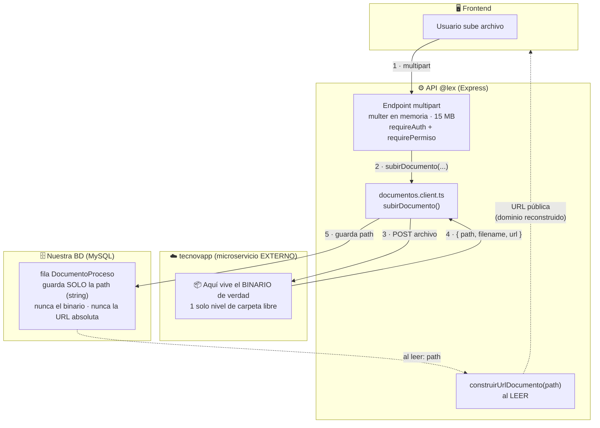
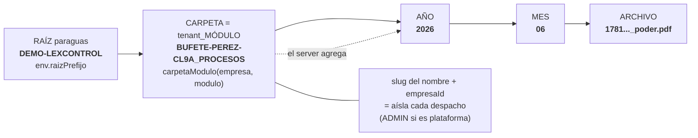
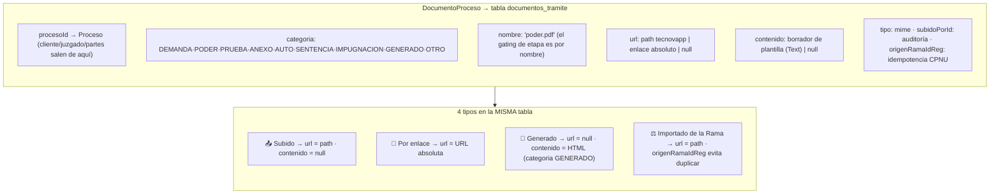

# Almacenamiento Documental — Diagramas

> Compañero visual del spec canónico [`spec.md`](./spec.md). El binario vive en un
> microservicio EXTERNO (tecnovapp); en nuestra BD guardamos únicamente la `path`
> relativa, y la URL pública se RECONSTRUYE al leer. Referencia de implementación:
> `lex-control-api/src/modules/documentos/documentos.client.ts`.

## 1. El principio: el binario NO vive con nosotros



Si cambia el dominio (DEMO → producción) los registros NO se tocan: solo cambia
`env.documentos.apiUrl` y `construirUrlDocumento` reconstruye contra el nuevo dominio.

## 2. Estructura de la carpeta en tecnovapp

tecnovapp solo permite **UN nivel de carpeta libre**. El server agrega AÑO/MES y pasa
a MAYÚSCULA.



Forma de la `path`: `{raizPrefijo}/{slug}-{empresaId}_{MÓDULO}/{YYYY}/{MM}/{filename}`

Ejemplos reales:

```
DEMO-LEXCONTROL / BUFETE-PEREZ-CL9A_PROCESOS  / 2026 / 06 / 1781..._poder.pdf
DEMO-LEXCONTROL / ADMIN_USUARIOS              / 2026 / 06 / 1781..._foto.jpg
DEMO-LEXCONTROL / BUFETE-PEREZ-CL9A_CONTRATOS / 2026 / 06 / 1781..._contrato.pdf
```

Claves del diseño:
- **Una sola raíz paraguas** por producto (`DEMO-LEXCONTROL` / `LEXCONTROL`).
- El **tenant va en el nombre de la carpeta** (`{slug}-{empresaId}`), no en un subnivel.
- El **detalle (qué proceso, cliente, juzgado) NO se modela en carpetas** — vive en la BD.

## 3. La fila en la BD y los 4 tipos que conviven

`DocumentoProceso` → tabla `documentos_tramite`.



## 4. Las dos reglas que lo sostienen

1. **Ningún módulo hace `fetch` directo a tecnovapp.** Todo pasa por
   `documentos.client.ts` (`subirDocumento` / `construirUrlDocumento`). Cambiar de
   proveedor o entorno = tocar solo `env.documentos`.
2. **Sin denormalizar.** El documento no copia datos del padre: "los poderes de este
   proceso" = `WHERE procesoId = X AND categoria = PODER` en la BD, no navegar carpetas.

El mismo patrón es **canónico y transversal**: `DocumentoContrato` (tabla
`documentos_contrato`) lo sigue igual, con su carpeta `{tenant}_CONTRATOS` y su columna `path`.
